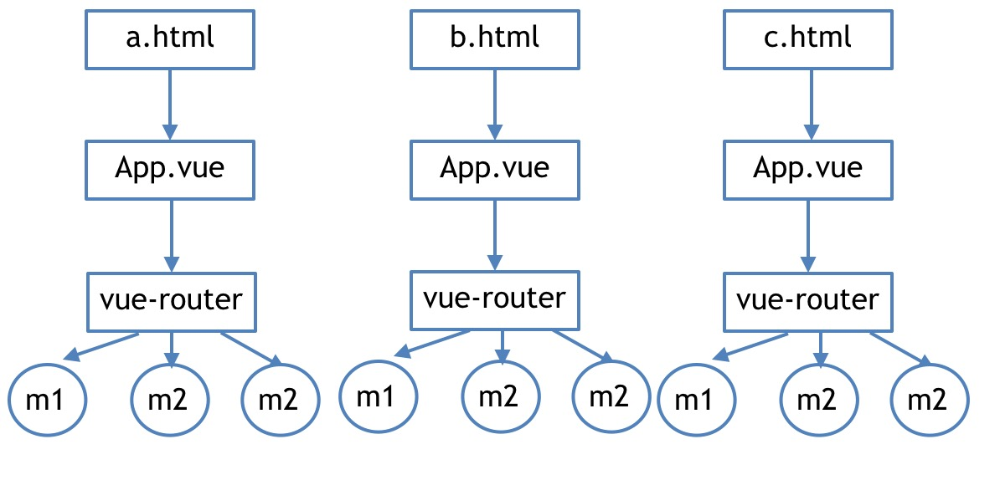
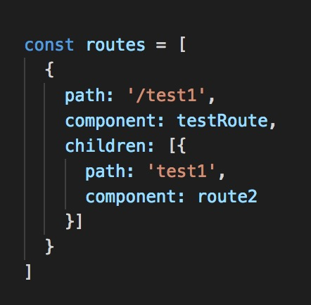
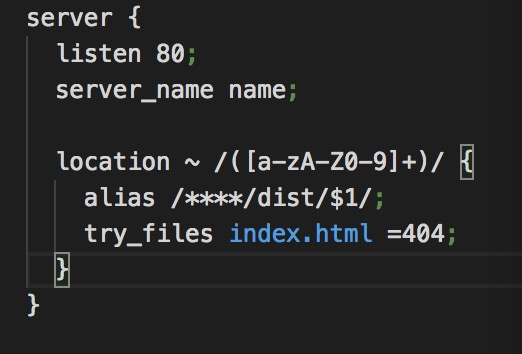

基于VUE2.0, VUE-Route实现的多页脚手架

适用于混合式app下的多页面入口及分模块发布

多页下单路由配置基与 children 实现







### 服务端配置

nginx:
   
   

node: (参考bin文件夹下dev.js配置： 基于express路由配置) 

### 开发目录
```
.
├── README.md
├── bin
│   ├── dev.js
│   └── build.js
│   └── server.js
├── redfiles.js(遍历目录)
├── app.js
├── dist(打包目录)
├── webpack.dev.conf.js
├── webpack.prod.conf.js
├── package-lock.json
├── package.json
├── src                  
│   ├── features
│      ├── test
|       |   └── container
|       |   └── store
|       |   └── App.vue
|       |   └── home.vue
|       |   └── router.js
|       |   └── main.js
│      ├── test2
|       |   └── container
|       |   └── store
|       |   └── App.vue
|       |   └── home.vue
|       |   └── router.js
|       |   └── main.js
│   ├── components(公共组件)
│   └── common(公共方法)
│   └── pluges(中加件)
├── view
│   ├── test.html
│   ├── test2.html
```


----

启动程序
``` bash

# serve with hot reload at localhost:8083
npm run dev

# build for production with minification
npm run build

```

----


### 结语
+ 拓展方向（结合nuxt做服务端渲染）
+ 单页面下可以引入vuex

...

👍👍👍


----
